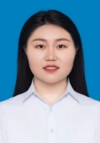

# 马梦茹

[Google Scholar](https://scholar.google.com.hk/citations?user=nEPyIP8AAAAJ&hl=zh-CN) | [CSDN](https://blog.csdn.net/qq_39630875?spm=1000.2115.3001.5343)

## 基本信息

- 姓名：马梦茹

- 电话：18832029556（同微信）

- 邮箱：mamengru@xidian.edu.cn

- 籍贯：陕西省渭南市合阳县

- 政治面貌：中共党员

- 出生年月：1996.07

- 导师：焦李成

- 学历：博士研究生

## 教育及工作经历

- 2024.12-至今 西安电子科技大学人工智能学院 全职博士后 助理研究员

- 2021.03-2024.12 西安电子科技大学 计算机科学与技术 博士阶段

- 2019.08-2021.03 西安电子科技大学 计算机科学与技术 硕士阶段

- 2015.08-2019.06 河北工程大学 通信工程 本科阶段

## 科研方向及成果

研究方向：多模态大模型、多源遥感影像融合解译、图文检索、视频生成、全景重建、参考语义分割与视觉定位协同等。依托智能感知与图像理解教育部重点实验室和国家自然科学基金委重点项目、联合基金项目以及面上项目的支持，相关内容及成果如下：

### 项目

- 2025年中国博士后科学基金面上项目，2025M771532，2025年6月-至今，在研，主持。

- 陕西省人力资源和社会保障厅：陕西省博士后科研项目资助三等资助，2025年10月，在研，主持。

- 2023年西安电子科技大学优秀博士学位论文资助基金：空谱超融合表征学习理论及应用研究，2023-至今，在研，主持。（相关链接：博“享”说 | 优秀博士学位论文资助者 人工智能学院 马梦茹）

- 2022年研究生创新基金项目：多尺度空谱选择的多模态遥感影像超融合解译，YJS2202，2022年3月-2022年12月，结题，主持。

- 2023年国家自然科学基金面上项目：基于多尺度稀疏表征学习的超融合解译研究，62276199，2023-至今，在研，参与（核心成员）。

### 专利&软著（授权）

- 马文萍、马梦茹、朱浩、武越、焦李成，一种逐像素分类方法、存储介质及分类设备，2024-02-06，中国，ZL 2020 1 0819496.0。（学生一作）

- 朱浩、马梦茹、洪世宽、马文萍、张俊、焦李成，一种基于多视点深度特征融合SENet网络的分类方法，2023-04-07，中国， ZL 2020 1 0373506.2。（学生一作）

- 马文萍、马梦茹、洪世宽、武越、朱浩、焦李成，基于深度学习的人脸检测识别系统软件V1.0，2020SR0130837。（学生一作）

- 马梦茹、洪世宽、朱浩、李亚婷。基于视觉人脸识别签到管理系统，2019SR1248697。

### 获奖荣誉

- 中国电子教育学会2025年度优秀博士学位论文优秀奖。

- 2026年获西安电子科技大学本科生教学准入证。

- 2022年1st ACRE Cascade Competition国际级国际级冠军；

- 2021年CVPR NTIRE 2021 Challenge on Multi-modal Aerial View Object Classification: Track 2 EO + SAR冠军；（相关链接：喜报|西电智能学子斩获国际2021CVPR竞赛4冠2亚1季军大奖）

- 2023年获得“[国家奖学金](https://gr.xidian.edu.cn/info/1073/13157.htm)”和“[盛路社会奖学金](https://gr.xidian.edu.cn/info/1054/13250.htm)”；

- 2024年获得“国家奖学金”和“中国电子科技集团公司-西安电子科技大学协同创新奖学金”；

### 论文

论文：中科院一区论文累计20余篇，其中以一作/通信作者发表中科院一区论文10余篇，总引用次数为417，单篇最高引用次数为95。

- Ma Mengru, Ma Wenping, Jiao Licheng, Liu Xu, Li Lingling, Feng Zhixi, Yang Shuyuan. A Multimodal Hyper-fusion Transformer for Remote Sensing Image Classification. Information Fusion, 2023, 96: 66-79.（中科院一区 Top期刊，IF：15.5）

- Ma Mengru, Ma Wenping, Jiao Licheng, Li Lingling, Liu Xu, Liu Fang, Yang Shuyuan, Guo Yuwei. A 3D Self-Awareness Diffusion Network for Multimodal Classification. IEEE Transactions on Multimedia, 2025, 27: 3462 - 3475.（中科院一区 Top期刊，CCF A类期刊，IF：9.7）

- Ma Mengru, Ma Wenping, Jiao Licheng, Liu Xu, Liu Fang, Li Lingling, Yang Shuyuan. MBSI-Net: Multimodal Balanced Self-Learning Interaction Network for Image Classification. IEEE Transactions on Circuits and Systems for Video Technology, 2023, 34(5): 3819-3833.（中科院一区 Top期刊，IF：11.1）

- Ma Mengru, Ma Wenping, Jiao Licheng, Liu Xu, Liu Fang, Li Lingling. Transfer Representation Learning Meets Multimodal Fusion Classification for Remote Sensing Images. IEEE Transactions on Geoscience and Remote Sensing, 2022, 60: 5632415.（中科院一区 Top期刊，IF：8.6）

- Ma Mengru, Zhao Jiaxuan, Ma Wenping, Jiao Licheng, Li Lingling, Liu Xu, Liu Fang, Yang Shuyuan. A Mamba-aware Spatial Spectral Cross-modal Network for Remote Sensing Classification. IEEE Transactions on Geoscience and Remote Sensing, 2025, 63: 4402515.（中科院一区 Top期刊，IF：8.6）

- Ma Wenping, Ma Mengru（通信作者）, Jiao Licheng, Liu Fang, Zhu Hao, Liu Xu, Yang Shuyuan, Hou Biao. An Adaptive Migration Collaborative Network for Multimodal Image Classification. IEEE Transactions on Neural Networks and Learning Systems, 2023, 35: 10935-10949.（中科院一区 Top期刊，IF：8.9）

- Ma Wenping, Chen Chuang, Ma Mengru（通信作者）, Zhang Hekai, Zhu Hao, Jiao Licheng. An Adaptive Dual-supervised Cross-deep Dependency Network for Pixel-wise Classification. IEEE Transactions on Geoscience and Remote Sensing, 2025, 63: 4402713.（中科院一区 Top期刊，IF：8.6）

- Ma Wenping, Zhang Hekai, Ma Mengru（通信作者）, Chen Chuang, Hou Biao. ISSP-Net: An Interactive Spatial-Spectral Perception Network for Multimodal Classification. IEEE Transactions on Geoscience and Remote Sensing, 2024, 62: 4412014.（中科院一区 Top期刊，IF：8.6）

- Ma Wenping, Xue Boyou, Ma Mengru（通信作者）, Chen Chuang, Zhang Hekai, Zhu Hao. A Diff-Attention Aware State Space Fusion Model for Remote Sensing Classification. IEEE Transactions on Geoscience and Remote Sensing, 2025, 63: 4421315.（中科院一区 Top期刊，IF：8.6）

- Ma Wenping, Zhang Hekai, Ma Mengru（通信作者）, Xue Boyou, Zhu Hao. HCMA-Net: Hierarchical Cross-Modality Aggregation Network for Multimodal Remote Sensing Image Classification. IEEE Transactions on Geoscience and Remote Sensing, 2025. 64: 4400417. （中科院一区 Top期刊，IF：8.6）

- Jiao Licheng(指导老师), Ma Mengru, He Pei, Geng Xueli, Liu Xu, Liu Fang, Ma Wenping, Yang Shuyuan, Hou Biao, Tang Xu. Brain-Inspired Learning, Perception, and Cognition: A Comprehensive Review. IEEE Transactions on Neural Networks and Learning Systems, 2024, 36(4): 5921 - 5941.（中科院一区 Top期刊，IF：8.9）

- Zhu Hao, Ma Mengru, Ma Wenping, Jiao Licheng, Hong Shikuan, Shen Jianchao, Hou Biao. A Spatial-channel Progressive Fusion ResNet for Remote Sensing Classification. Information Fusion, 2021, 70: 72-87.（中科院一区 Top期刊，IF：15.5）

- Jiaxuan Zhao, Licheng Jiao , Lingling Li, Mengru Ma, Xu Liu, Chao Wang, Fang Liu, Wenping Ma, Shuyuan Yang. S3Diffuser: Frequency selected state space guided diffusion model for multimodal fusion classification. Information Fusion, 2025，125: 103447. （中科院一区 Top期刊，IF：15.5）

## 未来工作规划

教学方面，可以胜任的课程有：

- 本科生课程：计算智能导论、人工智能概论、机器学习、深度学习、图像处理与机器视觉等。

- 研究生课程：神经网络、模式识别、人工智能、数字图像处理、智能图像处理等。

科研方面，研究方向如下：

- 极端环境下的图像融合解译：现有的图像融合算法均是基于正常成像场景设计的。图像融合算法应充分挖掘源图像中的信息以解决夜间、雨雾、过曝、欠曝等极端问题。

- 面向语义分割与视觉定位协同的遥感参考理解：现有方法多停留于解码多任务协同与表征统一，尚未解决微小目标特征提取不足和约束失效问题。参考理解应从微尺度跨模态特征增强与“先定位、后验证”的粗细粒度对齐层级推理两方面突破。

- 文生视频的状态一致性建模：现有文本驱动视频生成模型在推理阶段缺乏跨帧状态记忆机制，易出现主体漂移、外观变化及运动不连续等问题。生成算法需在推理阶段显式建模语义、外观与运动状态，以提升视频生成的时空一致性与稳定性。

- 由卫星图生成全景图的跨视角重建：现有的卫星图到地面全景图生成方法仍面临显著的跨视角差异问题。重建方法应从多尺度特征对齐、跨视角几何关系建模以及语义一致性约束等角度进行探索，同时结合生成模型与三维先验信息，提升由卫星图生成全景图的结构合理性、视觉真实性和场景一致性。

## 公共服务

- 会议报告：基于Mamba感知的空谱跨模态遥感影像融合分类, 第二届人工智能与遥感科学交叉论坛（AIRS-2025）, 云南昆明, 2025-07-18至2025-07-20

- 人工智能科普：人工智能的发展现状及其影响, 2025年陕西省全国科普月重点活动暨宝鸡市主场活动科普进校园报告会, 陕西宝鸡, 2025-09-12。

- 中国图象图形学学会会员，中国电子教育学会会员，陕西省女科技工作者协会会员；

- 担任IEEE TNNLS，TCSVT，EAAI，Scientific Data journal (Nature)，AAAI等权威期刊及会议审稿人；

- 2021年至今连续四年独立负责智能感知与图像理解（IPIU）实验室的公众号和今日头条，及西电人工智能研究院公众号的运营。流量累计3.6万次，其中IPIU会话、公众号消息和朋友圈等占1.4万次；

- 在2021年人工智能交叉学科前沿国际论坛、“双一流”学科与交叉学科建设论坛、从ChatGPT到GPT-4：新一轮人工智能变革与挑战、2024人工智能产学融合创新论坛和历年“一带一路”人工智能大会等国际会议中负责宣传短片和会场背景的制作、会议日程的发布、专家签到以及观点的整理等；

- 负责课题组大小会议的组织、安排，及团建活动，累计35人次；

- [学术博客（CSDN）](https://blog.csdn.net/qq_39630875?spm=1000.2115.3001.5343)72篇原创，1000+粉丝，访问量高达10万+。

## 教学工作

- 2025学年春季学期，计算智能课程导论。56学时，线下40学时，线上16学时。主要负责作业批改，实验课程授课，习题课答疑，热点科普等工作，96人次。

- 2025学年秋季学期，新生研讨与学科导论，20人次。

- 2025年度参加新入职教师教学基本技能培训，完成专题培训，微格教学、汇报展示等，考核合格。
